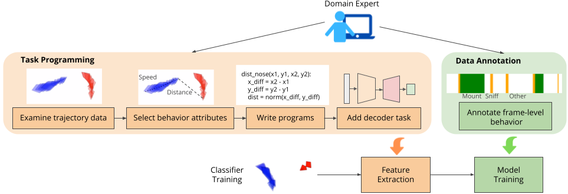

# Trajectory Embedding for Behavior Analysis (TREBA)

<p align="center"></p> 

Implementation from the paper: 
> Jennifer J. Sun, Ann Kennedy, Eric Zhan, David J. Anderson, Yisong Yue, Pietro Perona. [Task Programming: Learning Data Efficient Behavior Representations](https://arxiv.org/abs/2011.13917). In Conference on Computer Vision and Pattern Recognition (CVPR), 2021.

Awarded best student paper at CVPR2021! 

Our learned trajectory embeddings can be applied to a variety of behavior analysis tasks. Here we show instructions on training TREBA, and applying it to behavior classification. See [the tVAE repo](https://github.com/AndrewUlmer/MABe_2022_TVAE) from Andrew Ulmer for notebooks that uses the trajectory-VAE for representation learning!

<p align="center"></p> 


### Results on Fly Dataset
On the data split of the Fly v. Fly dataset provided in the Quick Start instructions below. 

| Input Features | MAP @ 10% Data | MAP @ 50% Data | MAP @ 100% Data |
|:-------|:-------:|:-------:|:-------:|
| Pose | 0.348 | 0.519 | 0.586 | 
| Pose + TREBA (TVAE only) | 0.419 | 0.635 | 0.722 |
| Pose + TREBA (w/ Task Programming) | 0.650 | 0.707 | 0.750 |
| Domain-specific features | 0.774 | 0.829 | 0.868 |
| Domain-specific features + TREBA (TVAE only) | 0.791 | 0.852 | 0.880 |
| Domain-specific features + TREBA (w/ Task Programming) | 0.820 | 0.868 | 0.886 |

Note that (TVAE only) corresponds to using trajectory generation losses from a Trajectory-VAE setup only, and (w/ Task Programming) corresponds to the decoder setup with programmed tasks using contrastive and consistency losses described in [our paper](https://arxiv.org/abs/2011.13917).

### Results on Mouse Dataset

| Input Features | Task 1 (F1 / MAP) | Task 2 (F1 / MAP) | Task 3 (F1 / MAP) |
|:-------|:-------:|:-------:|:-------:|
| Pose | 0.793 / 0.856 | 0.754 / 0.813 | 0.338 / 0.317 | 
| Pose + TREBA (w/ Task Programming) | 0.829 / 0.889 | 0.774 / 0.835 | 0.328 / 0.320 |


Since the data used in the mouse experiments in our paper is from an internal dataset, we show the task programming results here from the released [CalMS21 dataset](https://arxiv.org/abs/2104.02710). Link to download the dataset: [https://data.caltech.edu/records/1991](https://data.caltech.edu/records/1991). The dataset link also includes the pre-extracted TREBA features. To use the pre-extracted TREBA features for behavior classification on CalMS21, you can use the code in the [CalMS21 Classifier Repo](https://gitlab.aicrowd.com/aicrowd/research/mab-e/mab-e-baselines). The three tasks are:
* Task 1: Classic Classification - classify three behaviors of interest annotated by the same expert annotator.
* Task 2: Annotation Style Transfer - classify three behaviors of interest annotated by five different expert annotators.
* Task 3: New Behaviors - train classifiers to annotate new behaviors with only a few videos.

To train TREBA from scratch on the unlabeled subset, first download the data (unlabeled_videos) from [https://data.caltech.edu/records/1991](https://data.caltech.edu/records/1991) into util/datasets/mouse_v1 and unzip it, then you can use the script [util/datasets/mouse_v1/convert_calms21_to_npz.py](https://github.com/neuroethology/TREBA/blob/master/util/datasets/mouse_v1/convert_calms21_to_npz.py) to convert the CalMS21 json files to the npz files for training TREBA:
```
python convert_calms21_to_npz.py --input_directory unlabeled_videos --output_path data --data_split 229
```


## Quick Start

Follow these instructions if you would like to quickly try out training TREBA and using TREBA features in downstream behavior classification. Please see these additional instructions on [setting up a new dataset](DATASET_SETUP.md) and for [setting up new configurations](CONFIG_SETUP.md)

### Development Environment
Make sure you have the following dependencies installed before proceeding:
- Python 3+ distribution
- Training TREBA: 
    - PyTorch >= 0.4.0 
- Downstream classification: 
    - Tensorflow >= 2.0.0 (GPU not necessary, can install easily with pip install tensorflow or conda install tensorflow)
    
### Dataset

The original Fly vs. Fly dataset is available to download [here](https://data.caltech.edu/records/1893) ([Fly vs. Fly dataset paper](http://people.vision.caltech.edu/~xpburgos/papers/ECCV14%20Eyjolfsdottir.pdf)). We provide the processed Fly vs. Fly dataset with the dataset split used our paper at the following link:
https://drive.google.com/drive/folders/1Lxhexdb_XuwryLSb9JZqJThJAF6IKHs_?usp=sharing. 

There are three folders:
* data_for_classification contains the keypoints and hand-designed features for the fly dataset in train,val,test splits. This is only needed to train the downstream behavior classifiers. 
* fly_pre_trained_features contains the TREBA features extracted for fly classification trained with task programming and 13 programs. This is TREBA features extracted from a trained model that is ready for use. 
* data_for_training_treba_and_feature_extraction contains the fly dataset without labels for training the TREBA model, as well as the data in the form to use for feature extraction. This is the data needed to train the TREBA model.

### Running TREBA

There are two ways to run our model:
1. **Training from scratch**: Use the data in data_for_training_treba_and_feature_extraction to train TREBA (around 2 days on one GPU) and extract features (< 1 hour). Use the extracted features to train classifier models (< 1 hour for 1 training amount and 1 repeat, around 1 day on GPU for all training amounts (8 total) and repeats (9 total))
2. **Using pretrained features**: This step starts from already extracted TREBA features. Here, we use the data in fly_pre_trained_features to train classifier models (< 1 hour for 1 training amount and 1 repeat, around 1 day on GPU for all training amounts (8 total) and repeats (9 total))


### Instructions for Training TREBA 

You may skip this section if you start from the already extracted embeddings in fly_pre_trained_features.

If you wish to train the model from scratch instead of using the extracted embeddings, use the following instructions:

1. Download data from the "data_for_training_treba_and_feature_extraction" folder at the following link into util/datasets/fly_v1/data.
https://drive.google.com/drive/folders/1Lxhexdb_XuwryLSb9JZqJThJAF6IKHs_?usp=sharing

2. To run on GPU with device 0: 
```
python run_single.py \
-d 0 \
--config_dir fly_treba_original \
--feature_extraction fly_train_encoding,fly_val_encoding,fly_test_encoding \
--feature_names fly_train,fly_val,fly_test
```

If you are running on CPU, remove -d 0 from the command.

This run will take around ~1 day on GPU.

The trained models and extracted features will be saved to saved/fly_treba_original/run_1


### Instructions for Downstream Tasks (Behavior Classification)

If you wish to start from the pre-trained features, download data from the "fly_pre_trained_features" folder at the following link into saved/fly_treba_original/run_1/.
https://drive.google.com/drive/folders/1Lxhexdb_XuwryLSb9JZqJThJAF6IKHs_?usp=sharing

If you already followed the previous step, the extracted features from the previous step is already saved in saved/fly_treba_original/run_1/

1. Download data from 'data_for_classification' in the following link into util/datasets/fly_v1/data. This contains the Fly v. Fly data with behavior annotations.
https://drive.google.com/drive/folders/1Lxhexdb_XuwryLSb9JZqJThJAF6IKHs_?usp=sharing

2. From inside `downstream_tasks/fly_classification`, run:
```
python fly_classification_script.py \
--encodings fly_treba_original \
--input_type features \
--log_name fly_classification_log.txt \
--model_name fly_classification_model
```

(The input_type can be features for hand-designed features, or pose for detected fly poses/keypoints.)

This run will take ~1 day because by default, the code does 9 repeats of classifier training for 8 training data amounts. You can modify the first two lines for train_amount_list,repeats in fly_classifier_script to reduce the number of runs.

The final log will be saved in downstream_tasks/fly_classification.

## Acknowledgments 
We would like to thank the following Github repos for sharing their code, which helped development of TREBA:

[Style-Consistency Repo](https://github.com/ezhan94/calibratable-style-consistency)

[Supervised Contrastive Loss Repo](https://github.com/HobbitLong/SupContrast)

[Neuroethology Repos](https://github.com/neuroethology)

## License

Please refer to our paper for details and consider citing it if you find the code useful:
```
@inproceedings{task_programming,
  title={Task programming: Learning data efficient behavior representations},
  author={Sun, Jennifer J and Kennedy, Ann and Zhan, Eric and Anderson, David J and Yue, Yisong and Perona, Pietro},
  booktitle={Proceedings of the IEEE/CVF Conference on Computer Vision and Pattern Recognition},
  pages={2876--2885},
  year={2021}
}
```
TREBA is available under the [CC BY-NC-SA 4.0](https://creativecommons.org/licenses/by-nc-sa/4.0/) license.


